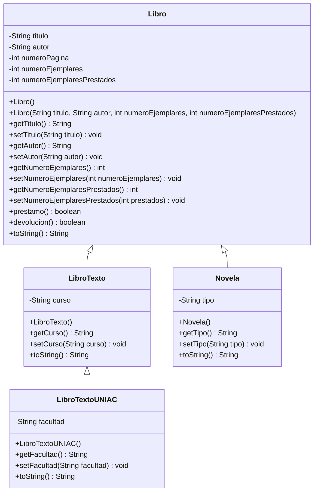

# Parcial Práctico I - Programación II (G412)

## Integrantes
* Will stiven franco caicedo
* Gian carlos nuñez quintero

## Diagrama UML

```mermaid
classDiagram
    class Libro {
        -String titulo
        -String autor
        -int numeroPagina
        -int numeroEjemplares
        -int numeroEjemplaresPrestados
        +Libro()
        +Libro(String titulo, String autor, int numeroEjemplares, int numeroEjemplaresPrestados)
        +getTitulo() String
        +setTitulo(String titulo) void
        +getAutor() String
        +setAutor(String autor) void
        +getNumeroEjemplares() int
        +setNumeroEjemplares(int numeroEjemplares) void
        +getNumeroEjemplaresPrestados() int
        +setNumeroEjemplaresPrestados(int prestados) void
        +prestamo() boolean
        +devolucion() boolean
        +toString() String
    }

    class LibroTexto {
        -String curso
        +LibroTexto()
        +getCurso() String
        +setCurso(String curso) void
        +toString() String
    }

    class LibroTextoUNIAC {
        -String facultad
        +LibroTextoUNIAC()
        +getFacultad() String
        +setFacultad(String facultad) void
        +toString() String
    }

    class Novela {
        -String tipo
        +Novela()
        +getTipo() String
        +setTipo(String tipo) void
        +toString() String
    }

    Libro <|-- LibroTexto
    LibroTexto <|-- LibroTextoUNIAC
    Libro <|-- Novela
```