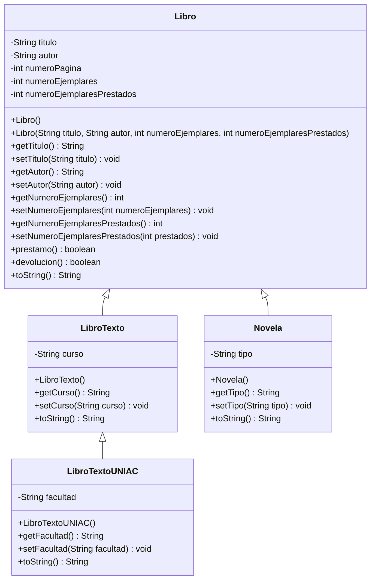

# Diagrama UML



## Pruebas en `main`

La clase `App` crea una novela de tipo "Aventuras" y prueba los casos válidos e inválidos de préstamo y devolución. Los resultados esperados son `true`, `false`, `true` y `false`, respectivamente.

## Escenarios hipotéticos de herencia

Estos fragmentos ilustran cambios que harían fallar el acceso o la extensión. No están aplicados al código actual.

1. **Atributo privado en la superclase:** un atributo `private` no se puede leer directamente desde una subclase. La línea marcada produciría un error de compilación:

```java
class Libro {
    private String titulo;
}

class Novela extends Libro {
    void mostrarTitulo() {
        System.out.println(titulo); // Error: titulo es privado en Libro
    }
}
```

En el proyecto, los campos de `Libro` son privados; las subclases utilizan `super.toString()` o getters, por lo que actualmente no intentan acceder a ellos directamente.

2. **Superclase declarada `final`:** una clase `final` no admite subclases. Si `Libro` se declarara así, las declaraciones existentes `LibroTexto extends Libro` y `Novela extends Libro` no compilarían:

```java
public final class Libro {
}

public class Novela extends Libro { // Error: no se puede heredar de Libro final
}
```

## Extensiones posibles

- `isbn` (`String`): identificador normalizado para distinguir ediciones.
- `editorial` (`String`): nombre de la editorial que publicó el libro.
- `calcularEjemplaresDisponibles()` (`int`): devuelve el total menos los ejemplares prestados.

```java
public int calcularEjemplaresDisponibles() {
    return getNumeroEjemplares() - getNumeroEjemplaresPrestados();
}
```